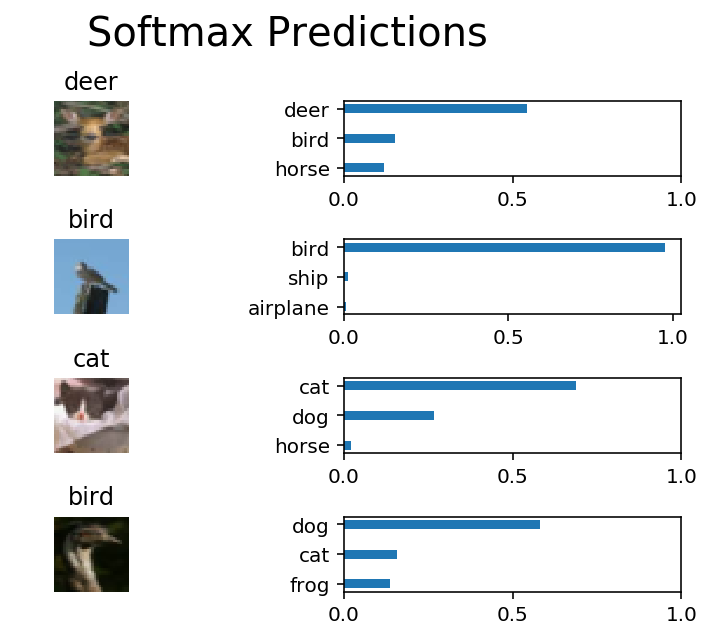

# Classifying-Images-With-Tensorflow
Use TensorFlow to create a convolutional neural network that can classify images into one of ten categories from the CIFAR-10 dataset. This project taught me how to normalize input images and one-hot encode labels. I utilized max pooling, dropout, and fully connected layers to create a convolutional neural net.

The network performs at a 68.42% accuracy, which isn't bad for the simple convolutional net used here. As you can see below, the network accurately classifies the first three images (with varying degrees of confidence), but fails to identify 'bird' as one of the top three probabilities in the last image. 

